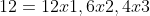

# Algoritmo para factorizar N


En este artículo, vamos a explorar un **algoritmo para factorizar un número **`N` La factorización de un número es un proceso fundamental en matemáticas y ciencias de la computación, ya que nos permite descomponer un número en sus factores primos o divisores. Aunque puede parecer una tarea sencilla, existen varios enfoques y optimizaciones que pueden hacerla más eficiente, especialmente cuando el número `N` es grande.

## **Análisis y Diseño del Algoritmo**

Para diseñar este algoritmo, comenzamos por identificar que, en lugar de verificar todos los números hasta `N`, podemos reducir la búsqueda de divisores hasta la **raíz cuadrada de `N`**. Esto se debe a que si `N` tiene un divisor mayor que su raíz cuadrada, el otro divisor será menor, por lo que no es necesario seguir buscando más allá de ese punto.

A partir de allí, implementamos un ciclo que va desde 2 hasta la raíz cuadrada de `N`, dividiendo `N` por cada número en ese rango. Si encontramos que la división es exacta, guardamos el divisor y seguimos buscando.

Este algoritmo no solo es eficiente, sino que también es fácil de implementar. A lo largo del artículo, proporcionamos un **diagrama de flujo** y un pseudocódigo que ilustran claramente cada paso del proceso.

¡Vamos a profundizar en cómo podemos poner este algoritmo en práctica!

## Definición de factorización (Entender el problema)

La **factorización** de un número es el proceso de descomponerlo en un conjunto de **factores** que, multiplicados entre sí, dan como resultado el número original. Estos factores pueden ser cualquier tipo de números enteros, no necesariamente primos, y pueden ser números compuestos o incluso el mismo número 1.

Cuando hablamos de **factorización** en un sentido amplio, podemos referirnos a todas las maneras en que un número puede expresarse como un producto de **factores enteros**. Pero no todas esas expresiones se consideran "*factorizaciones completas*" o "*factorizaciones fundamentales*", ya que algunas de ellas no son tan informativas desde una perspectiva matemática. 

### 1. **Factorización de un número en términos de factores enteros**:

En un sentido más general, cualquier número entero positivo puede ser factorizado en productos de factores enteros. Para 12, como mencionas, los factores enteros de 12 serían:



Es decir, estamos descomponiendo 12 en una variedad de productos de números enteros.

### 2. **Factorización completa (o trivial)**:

Sin embargo, normalmente se habla de **factorización completa** o **factorización no trivial** cuando estamos buscando factores que no sean simplemente el número mismo (12) ni el 1. Si sólo tomamos las factorizaciones no triviales, entonces las posibles factorizaciones de 12 son:


### 3. **Factorización prima**:

Este es el caso más específico, donde buscamos descomponer un número en **factores primos**. La factorización prima de 12 es:


Aquí estamos descomponiendo 12 hasta sus bloques fundamentales, que son los números primos.

## ¿Cómo encontrar todos los divisores de un número `N` en la **factorización de números enteros y completa**?

1. **Calcular la raíz cuadrada de N**:

   - Calculamos la raíz cuadrada de `N`, solo necesitamos **probar divisores** hasta el valor entero de la raíz cuadrada.
   - Por ejemplo, para `N=45`, la raíz cuadrada de `45` es aproximadamente `6.7082`. Por lo tanto, solo necesitamos probar los números desde `2` hasta `6` (la raíz cuadrada entera de `45`).

2. **Probar divisores**:

   - Probamos todos los números desde `2` hasta la raíz cuadrada entera de `N` para ver si dividen exactamente a `N` (sin dejar residuo).

   - Si encontramos que  (es decir, `d` es un divisor y `q` es el cociente), entonces `d` y `q` son factores de `N`.
   
3. **Ejemplo con `45`**:

   - La raíz cuadrada de `45` es aproximadamente `6.7082`, así que solo necesitamos probar los divisores hasta `6`.
   - Dividimos `45` entre los números `2,3,4,5,6`:
     - `45 ÷ 2 = 22.5` (no es un divisor exacto).
     - `45 ÷ 3 = 15` (es un divisor exacto).
     - `45 ÷ 4 = 11.25` (no es un divisor exacto).
     - `45 ÷ 5 = 9` (es un divisor exacto).
     - `45 ÷ 6 = 7.5` (no es un divisor exacto).
   - Los divisores que encontramos son `3` ,`15`,  `5` y `9`.
   - También incluimos en la respuesta al `1` y a `45`

## Diagrama de flujo


## Pseudo código

```
Start

obtain N  
calculate DivisionLimit = Floor(SquareRoot(N))  
set CurrentDivisor = 2  

repeat-until CurrentDivisor > DivisionLimit  
  if CurrentDivisor <= DivisionLimit then  
    calculate PossibleDivisor = N / CurrentDivisor  

    if PossibleDivisor == IntegerPart(N / CurrentDivisor) then  
      save CurrentDivisor and PossibleDivisor as divisors  
    else  
      calculate CurrentDivisor = CurrentDivisor + 1  
    end-if  
  else  
    calculate CurrentDivisor = CurrentDivisor + 1  
  end-if  
repeat-until wrong  

display 1, N, and the divisors found  


End
```


## **Análisis Temporal (Big O para el tiempo de ejecución)**

El algoritmo implica los siguientes pasos principales:

1. **Calcular la raíz cuadrada de N:**

   - Esto se puede hacer en tiempo **O`(log ⁡N)`**, porque la mayoría de los métodos modernos para calcular raíces cuadradas utilizan iteraciones logarítmicas (e.g., método de Newton).

2. **Probar divisores desde 1 hasta la raíz cuadrada entera de N**

   - Este es el paso más importante. El algoritmo itera desde 1 hasta la raíz cuadrada de `N`, es decir: lo que requiere:
     
       iteraciones.
     
   - En cada iteración, verificamos si `N`es divisible por el divisor actual (`d`), lo cual implica una operación **O`(1)`**  (la división es una operación constante).
   
   Por lo tanto, este paso tiene complejidad: 
   
   

3. **Registrar los pares de divisores:**

   - Por cada divisor `d`encontrado, el cociente `N/d` se calcula y se guarda. Esto también es una operación **O`(1)`**  por divisor.

   - Como máximo, encontramos la raíz cuadrada entera de `N`de divisores (en pares), por lo que este paso también tiene un costo de .
   
   En total, la complejidad temporal del algoritmo es:  porque el cálculo de divisores domina el tiempo de ejecución.
   


## **Análisis Espacial (Big O para el uso de memoria)**

El algoritmo requiere almacenar los divisores encontrados y sus correspondientes pares. Analicemos esto:

1. **Espacio para los divisores:**

   - En el peor caso, el número total de divisores de un número `N`es aproximadamente  Esto ocurre porque cada divisor menor que la raíz cuadrada de `N` tiene un par correspondiente mayor que la raíz cuadrada de `N`
   
2. **Variables auxiliares:**
- El algoritmo utiliza variables para `N`, `d` (el divisor actual), la lista de divisores, y posiblemente otras variables para los resultados. Todas estas requieren espacio constante adicional **(O(1))**.

Por lo tanto, la complejidad espacial total del algoritmo es: principalmente para almacenar los divisores).


## Ponemos datos al análisis temporal y espacial del Big O

### Análisis temporal, número de procesos necesarios

Para calcular los divisores de: 

1. **Raíz cuadrada de N**

   - La raíz cuadrada entera de ⌊4530940⌋=2129 (redondeamos hacia abajo).

2. **Iteración hasta 2129**

   - El algoritmo prueba cada número entero `d` desde `1` hasta `2129`
   - Para cada `d`
     - Se verifica si `N` mod  d=0 (Operación de residuo)
     - Si `d` es un divisor, se calcula su par complementario `N/d`-
   - En el peor caso, se realizan `2129`divisiones y verificaciones del residuo.

3. **Divisores complementarios:**

   - Para cada divisor `d` encontrado, el divisor complementario `N/d` también se registra si es diferente de `d`.

   Por ejemplo, si `d=1`, el complemento es 4530940, y si `d=2`, el complemento es 2265470.

4. **Número total de operaciones:**

   - En cada iteración, realizamos una división y verificamos divisibilidad. Esto resulta en  operaciones.
     
   - Cada divisor tiene un complemento, así que el número total de divisores registrados puede llegar a `2 x cantidad de divisores únicos`

​		Para N = 4530940, estos divisores naturales son:  en total 18 divisores, considerando complementos.

5. **Número final de operaciones**

   - Operaciones de divisibilidad: 2129

   - Cálculos de divisores complementarios: ≤ número de divisores naturales.

   - Total: 2129 operaciones dominantes 

### Análisis espacial (Uso de la memoria)

**Almacenamiento de divisores naturales**:

- Como buscamos todos los divisores, debemos guardar **cada divisor d y su complemento N/d**.
- Si hay `D` divisores únicos, el almacenamiento será `2D`.

En este caso, `D=9`, por lo que:

​	`2D×4` bytes (por entero) =`18 × 4 = 72` bytes

**Variables auxiliares:**

- `N`, `d`, raíz cuadrada(N): `3 x 4`bytes `= 12`bytes.

**Memoria total requerida:**

- Divisores: 72 bytes-
- Variables auxiliares: 12 bytes-
- Total: **84 bytes**.


## Conclusión

En este artículo hemos explorado un proceso simple para encontrar los divisores de un número entero `N`, de forma eficiente,  A través del análisis previo (revisando los conceptos matemáticos al rededor de este tema), detallamos cómo utilizar la raíz cuadrada de `N` para establecer un límite en el cual buscar divisores. Luego, podemos ver todo el proceso de cómo dividir `N` por un número `i` (empezando desde `2`) y verificar si la división produce un número entero, lo que indica que `i` es un divisor de `N`.

A lo largo de esta explicación, proporcionamos un **diagrama de flujo** para visualizar el proceso paso a paso, mejorando la comprensión del algoritmo. También ajustamos los nombres de las variables para hacerlos más intuitivos y alineados con el propósito de encontrar divisores de un número.

Al final hacemos el análisis temporal y espacial bajo la notación **Big O**, para poner datos a la eficiencia del resultado.

En el mundo de la informática, entender cómo manipular números y aplicar algoritmos sencillos como este es clave para resolver problemas más complejos.

**Feliz programación!** ❤️😀
